# bairelay — Code Paths

Mermaid companion to `docs/architecture.md`. Architecture explains *why* the
system is shaped this way; this file traces *what calls what*. Verified against
`main`, 2026-08-18 (single-crate tree, post `stream_translate.rs`). Line
numbers drift; module and function names are the durable anchors. Annotated
risks cite `docs/action-plan.md` item IDs.

---

## 1. Module map and layering

One crate. The four protocol directories know nothing about cameras; the
compiler no longer enforces this (the crates were merged) — review does.
Dotted edges are consumer-declared trait seams: the arrow always points from
camera-side into the protocol module, never back.

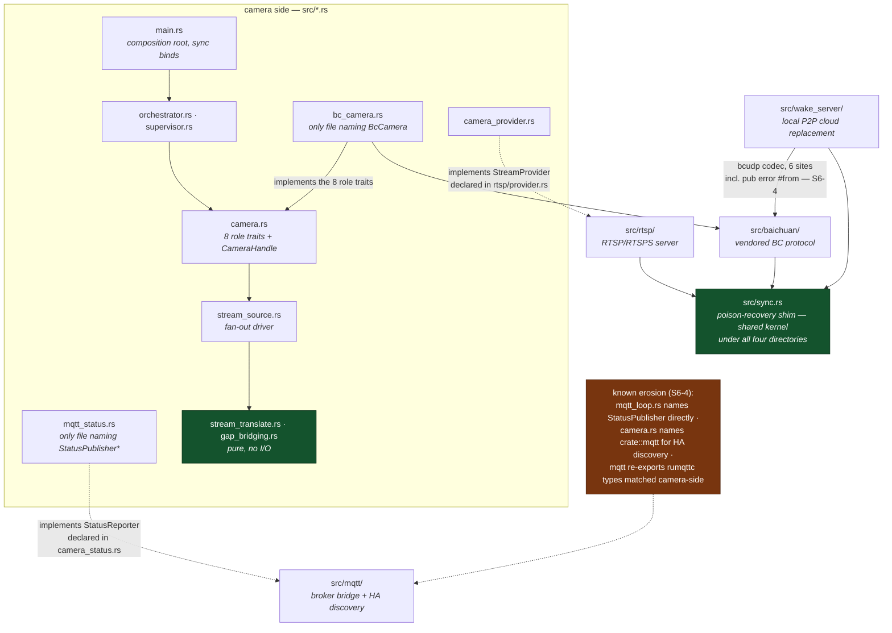

---

## 2. Startup sequence

`src/main.rs`. Every socket binds **synchronously before any "started" log
line**; a bind failure halts startup rather than half-starting the daemon.

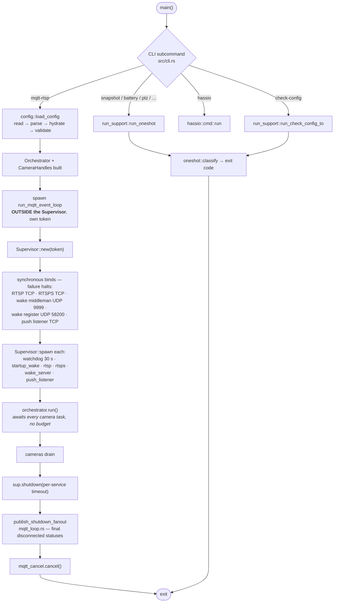

The MQTT event loop lives outside the `Supervisor` because per-camera teardown
publishes a final `disconnected` status through it — it must outlive every
camera task, and shutdown ordering (`sup.shutdown()` before
`mqtt_cancel.cancel()`) preserves that.

---

## 3. Cancellation token tree

Global → per-subsystem → per-camera → per-session → per-stream. Cancelling a
parent cancels every descendant; a session token kills pollers without tearing
down the camera.

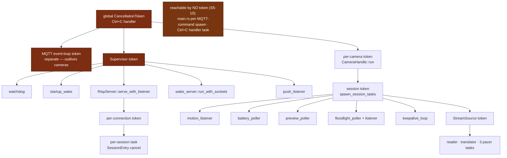

---

## 4. Per-camera lifecycle

`CameraHandle::run` — the state machine the whole battery design hangs off.

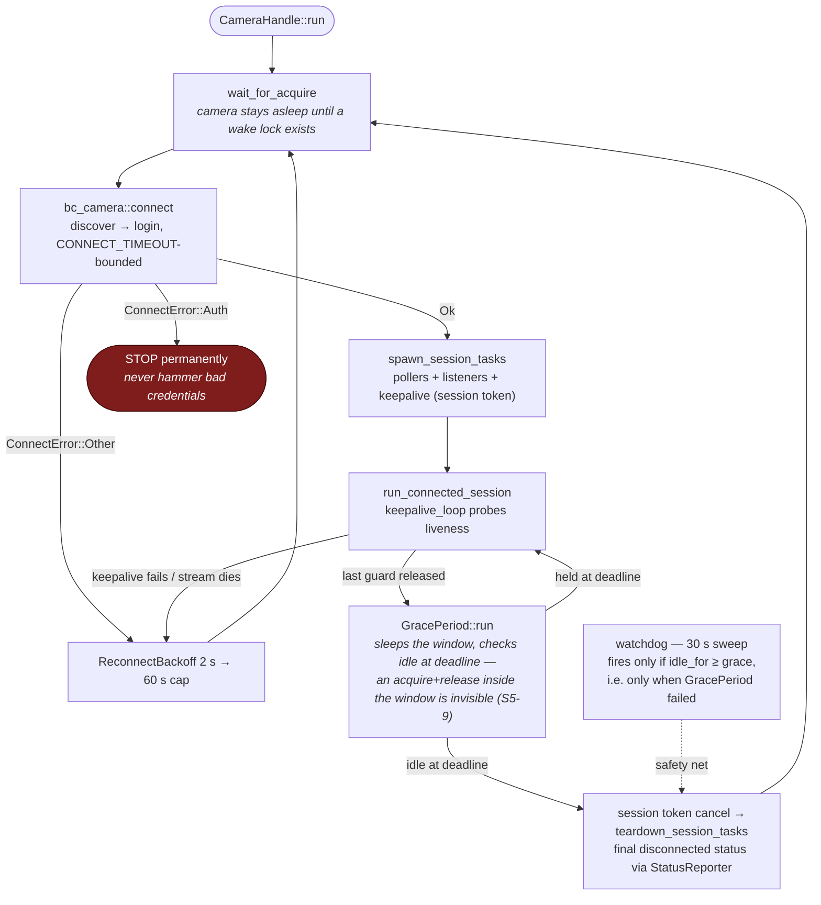

---

## 5. Media data path (camera → RTP)

The longest path in the system. Since S4-1 the translation core is **pure**:
`translate()` takes a packet, mutable state, a clock value, and the bridging
flag, and returns emits — no channel, lock, or socket in any signature.

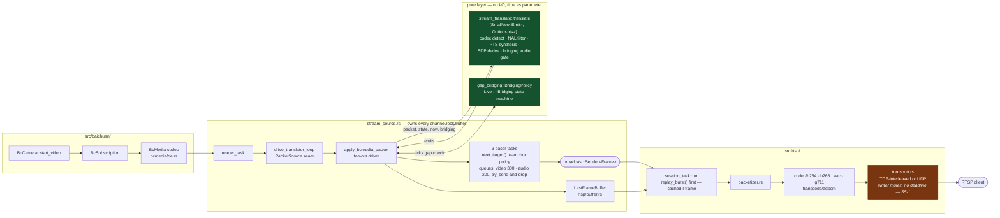

`LastFrameBuffer` is the cross-cutting object: written by the driver on
I-frames, read by `replay_burst` so a joining client gets a keyframe instantly,
and pre-warmed at boot by `startup_wake::warm_last_frame_buffers`.

---

## 6. Gap bridging state machine

`src/gap_bridging.rs` — pure; `stream_source.rs::tick_bridging` is its clock
and driver. The battery concession: cameras stop sending, RTSP clients must
keep seeing continuous RTP.

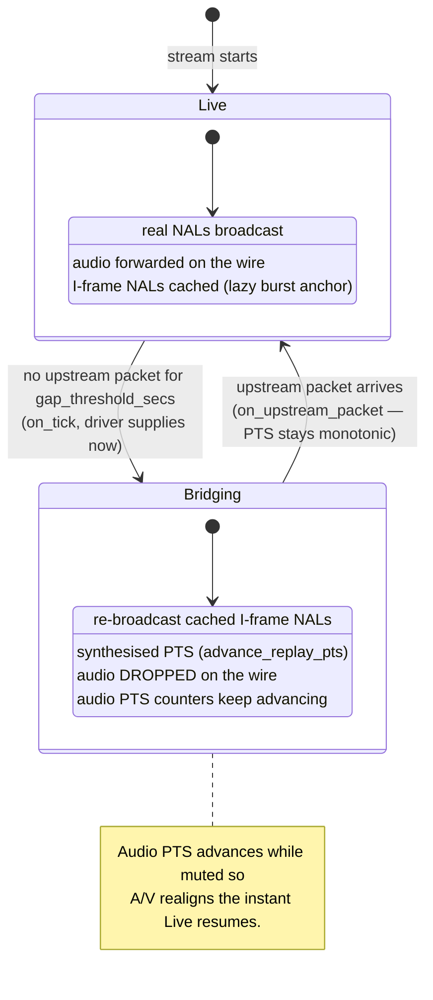

---

## 7. RTSP request path

One task per TCP connection, one per PLAYing session. Auth is hardened:
Basic is offered/accepted only over TLS; digest verification is constant-time
across users.

```mermaid
sequenceDiagram
    autonumber
    participant C as RTSP client
    participant CN as connection.rs<br/>handle_connection
    participant A as protocol/auth.rs
    participant P as StreamProvider<br/>(camera_provider.rs)
    participant R as SessionRegistry
    participant ST as session_task.rs

    C->>CN: DESCRIBE rtsp://host/cam/main
    CN->>A: authenticate()
    A-->>CN: Digest challenge / Ok(user)<br/>(Basic only if is_tls)
    CN->>P: subscribe(camera, kind, user)
    Note over P: ACL check → wake lock acquire →<br/>SubscriptionHandle{rx, last_frame, sdp, guard}
    CN->>C: 200 + SDP

    C->>CN: SETUP (per track)
    CN->>R: create/extend session, allocate transport<br/>(udp_pool port pair or interleaved)
    CN->>C: 200 Transport … Session: {sid};timeout=30

    C->>CN: PLAY
    CN->>ST: spawn session task
    ST->>C: replay_burst() — cached I-frame first
    loop while playing
        ST->>C: RTP via video/audio dispatch loops
    end

    C->>CN: TEARDOWN
    CN->>R: drop session entry
    ST-->>P: SubscriptionHandle drop → wake lock released
    Note over R: 5 s sweep expires sessions idle > 30 s
```

---

## 8. Wake sources → wake lock

Every path that keeps a battery camera awake converges on
`WakeLockCounter` (`AtomicUsize` + two `Notify`s, permit-storing).

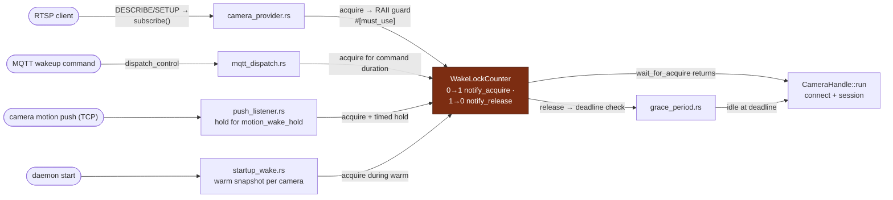

Leak risk (S5-1): a session task wedged in `transport.rs::send_rtp` (no write
deadline) never drops its `SubscriptionHandle`, so the guard — and the camera —
never sleeps.

---

## 9. MQTT paths — control in, status out

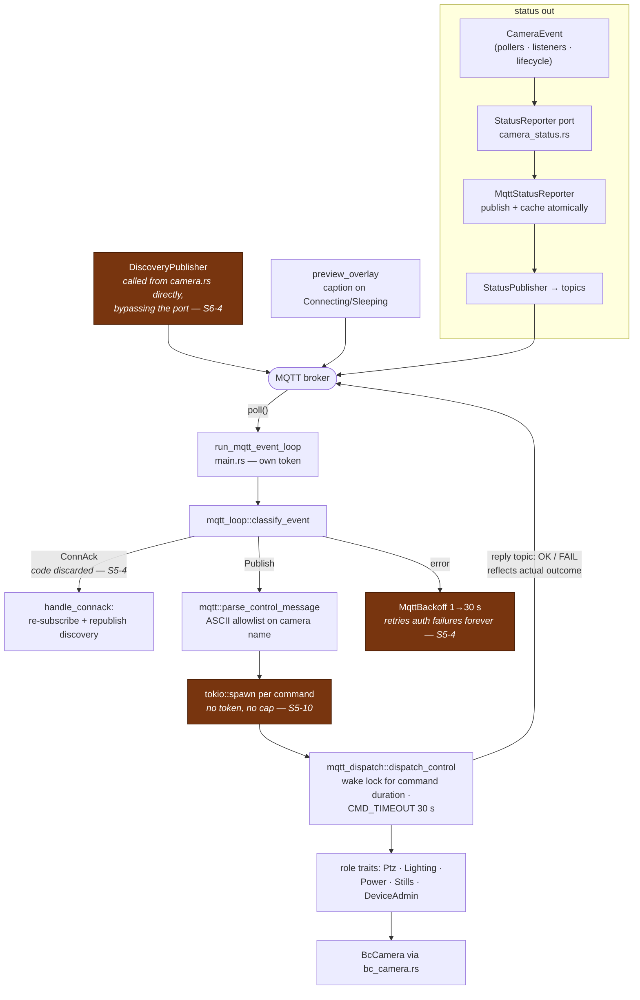

---

## 10. Camera connect and login (vendored core)

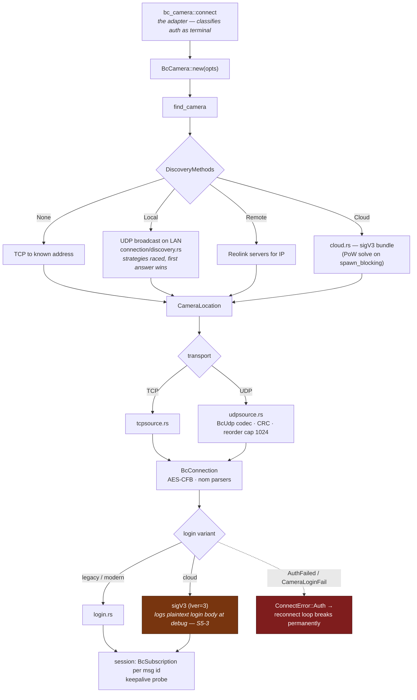

---

## 11. Wake server and push listener

The local replacement for Reolink's P2P cloud — a battery camera wakes without
traffic leaving the LAN.

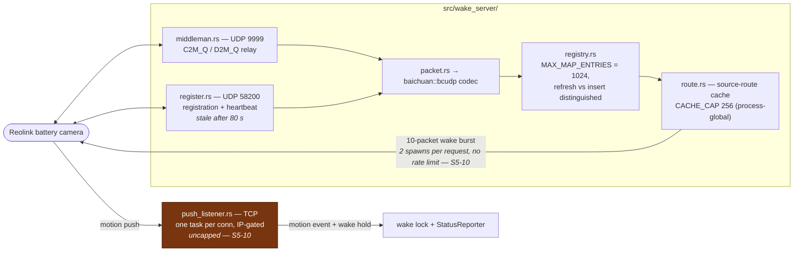

---

## 12. One-shot command path

Connect, do one thing, log out, exit with a coarse code — fully separate from
the daemon.

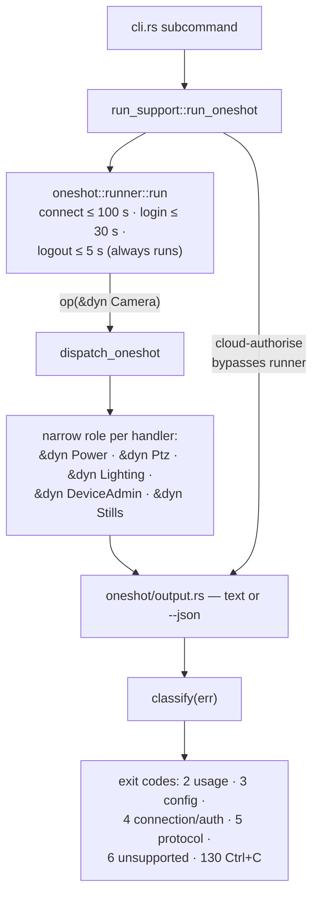

---

## 13. Test seams

Everything is tested through consumer-declared traits, never live hardware.

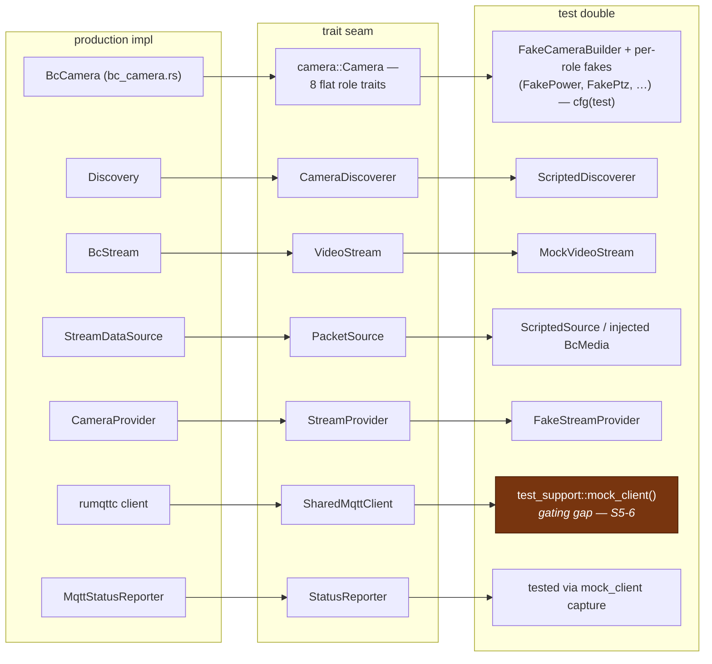

The pure modules (`stream_translate.rs`, `gap_bridging.rs`) need **no doubles
at all** — no runtime, no timeouts, microsecond tests. Prefer adding a policy
test there over driving the same logic through a task loop.

---

## 14. Shared-state map

Which objects cross task boundaries. The poison sweep landed: everything goes
through `src/sync.rs`'s recovery traits; zero locks are held across `.await`
(machine-enforced by `clippy::await_holding_lock` + `-D warnings`).

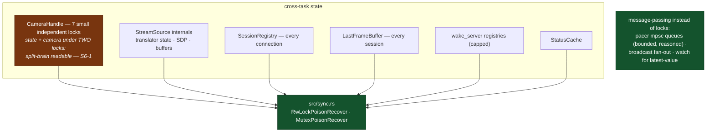

---

## Cross-reference to the action plan

Annotated risks in these diagrams map to `docs/action-plan.md` items:

| Diagram | Item |
|---|---|
| §5 §8 transport write, wake-lock leak | **S5-1** |
| §9 ConnAck discarded, infinite auth retry | **S5-4** |
| §3 §9 §11 token-less / uncapped spawns | **S5-10** |
| §10 sigV3 login body at debug | **S5-3** |
| §4 grace period check-at-deadline vs doc | **S5-9** |
| §13 mock_client gating gap | **S5-6** |
| §14 CameraHandle split-brain state | **S6-1** |
| §1 wake_server→baichuan edge, discovery bypassing the port | **S6-4** |
