# Bairelay — Code Paths

Mermaid companion to `docs/architecture.md`. Architecture explains *why* the
system is shaped this way; this file traces *what calls what*, with file and
line anchors so a diagram edge can be checked against source.

Anchors were verified against the tree at `2baf5a6`. Line numbers drift; module
and function names are the durable part.

---

## 1. Crate dependency graph

Four library crates plus one binary. The rule that keeps this acyclic: **no
library crate depends on another library crate except `wake-server → core`**,
and no library crate knows what a camera is except `core`.

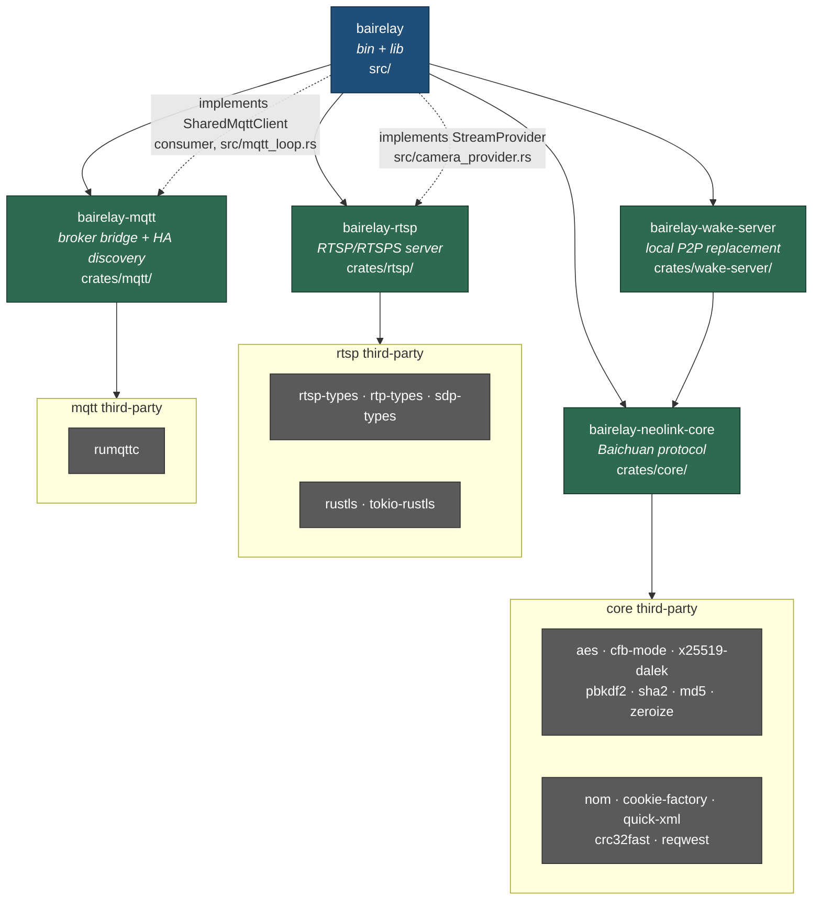

The dotted edges are the point of the design, and they run the *same* direction
as the solid ones on purpose: there is no arrow from a library back to the
binary. `crates/rtsp/` declares `StreamProvider` (`crates/rtsp/src/provider.rs`)
and the binary supplies the impl (`src/camera_provider.rs`), so camera concepts
never enter the RTSP crate. Same for `crates/mqtt/`, which knows about topics
and payloads but not cameras.

**Known duplication** (`cargo tree -d`): `rand` 0.8 + 0.9, `thiserror` 1 + 2,
`getrandom` ×3, `rand_core` ×2, `hashbrown` ×2, `rustls-webpki` ×2, `syn` ×2.
`rand 0.8` is a *direct* dep of core, rtsp and wake-server — migrating those
three collapses most of it (remediation P2-4).

---

## 2. Startup sequence

`src/main.rs`. Every socket binds **synchronously before any "started" log
line**, so a bind failure halts startup rather than half-starting the daemon.

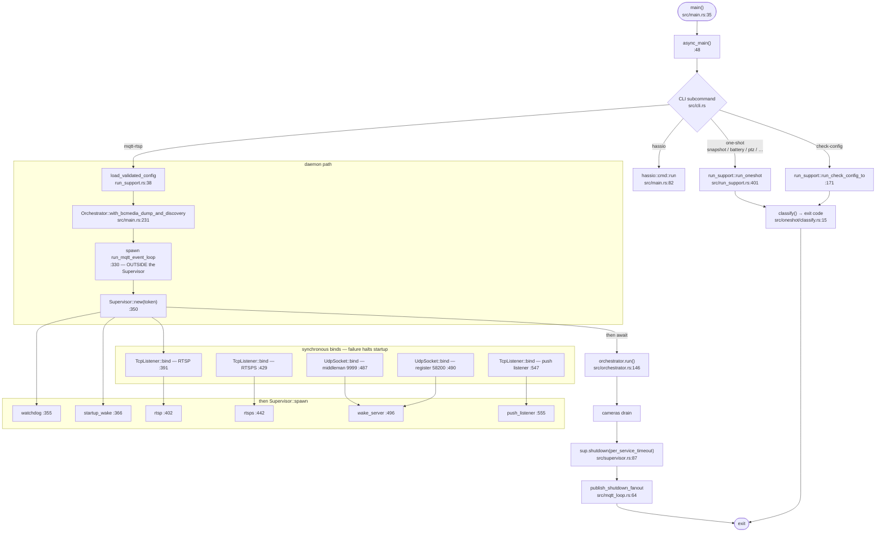

The MQTT event loop deliberately lives **outside** the `Supervisor`: per-camera
teardown publishes a final `disconnected` status through it, so it must outlive
every camera task.

---

## 3. Cancellation token tree

Three levels. Cancelling a parent cancels every descendant; a session token
cancels pollers and listeners without tearing down the camera.

```mermaid
graph TD
    G["global CancellationToken<br/>src/main.rs — Ctrl+C via<br/>run_support::spawn_ctrl_c_cancel:90"]
    MQTTTOK["MQTT event-loop token<br/>separate, outlives cameras"]
    SUPTOK["Supervisor token<br/>src/supervisor.rs:40"]

    subgraph CAMTOK ["per-camera token — src/camera.rs"]
        direction TB
        CR["CameraHandle::run()<br/>src/camera.rs:1213"]
    end

    subgraph SESS ["per-session token — cancelled on disconnect"]
        direction TB
        ML["camera_tasks::motion_listener:27"]
        BP["camera_tasks::battery_poller:212"]
        PP["camera_tasks::preview_poller:307"]
        FP["camera_tasks::floodlight_poller:397"]
        FL["camera_tasks::floodlight_listener:433"]
        KA["core keepalive<br/>crates/core/src/bc_protocol/keepalive.rs"]
    end

    G --> MQTTTOK
    G --> SUPTOK
    G --> CR

    SUPTOK --> W["watchdog<br/>src/watchdog.rs — 30 s safety net"]
    SUPTOK --> SW["startup_wake::warm_last_frame_buffers<br/>src/startup_wake.rs:58"]
    SUPTOK --> RS["RtspServer::serve_with_listener<br/>crates/rtsp/src/server/listener.rs:63"]
    SUPTOK --> WS["wake_server::run_with_sockets<br/>crates/wake-server/src/lib.rs:64"]
    SUPTOK --> PL["push_listener::run_with_listener<br/>src/push_listener.rs:92"]

    CR --> ML
    CR --> BP
    CR --> PP
    CR --> FP
    CR --> FL
    CR --> KA

    classDef tok fill:#7c2d12,stroke:#431407,color:#fff
    class G,MQTTTOK,SUPTOK tok
```

---

## 4. RTSP request path

`crates/rtsp/src/server/`. One task per TCP connection; one task per PLAYing
session.

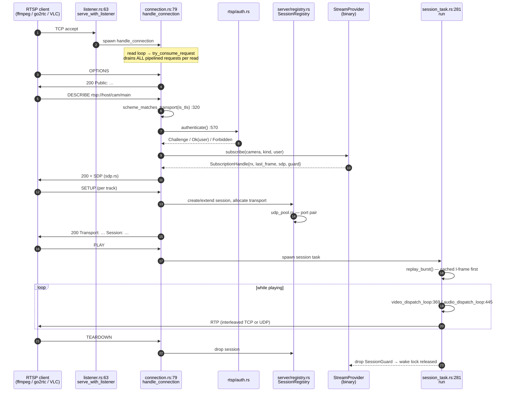

**P0-2 lives at step 8**: `authenticate()` emits a `WWW-Authenticate: Basic`
challenge and accepts a `Basic` header *unconditionally*, even though
`ConnectionState::is_tls` is right there and already consulted at line 320.

The session task is a coordinator: after the PLAY gate it spawns two
independent per-kind dispatch loops, each owning its own
`broadcast::Receiver`. Periodic **RTCP Sender Reports are deliberately not
emitted** — the SR helpers in `crates/rtsp/src/server/rtcp.rs` exist for a
future SR-emitting context (`session_task.rs:1–8`).

---

## 5. Media data path (camera → RTP)

The longest path in the system, and the one `src/stream_source.rs` (5441 lines)
exists to serve.

```mermaid
flowchart LR
    subgraph CAM ["camera — crates/core/"]
        direction TB
        C1["BcCamera::start_video<br/>bc_protocol/stream.rs"]
        C2["BcSubscription<br/>connection/bcsub.rs"]
        C3["BcMedia codec<br/>bcmedia/de.rs"]
        C1 --> C2 --> C3
    end

    subgraph SRC ["src/stream_source.rs"]
        direction TB
        R["reader_task :1263"]
        T["drive_translator_loop :1432<br/>(PacketSource seam)"]
        AP["apply_bcmedia_packet :1686"]
        IF["handle_iframe :1734"]
        PF["handle_pframe :2018"]
        AA["handle_aac :2217"]
        PACE["media_pacer_task :1065<br/>video_pacer_task :1025<br/>audio_pacer_task :993"]
        BC(["broadcast::Sender&lt;Frame&gt;"])
        LFB["LastFrameBuffer<br/>crates/rtsp/src/buffer.rs"]

        R --> T --> AP
        AP --> IF
        AP --> PF
        AP --> AA
        IF --> PACE
        PF --> PACE
        AA --> PACE
        PACE --> BC
        IF --> LFB
    end

    subgraph OUT ["crates/rtsp/"]
        direction TB
        SUB["session_task::run :281"]
        PK["server/packetizer.rs"]
        CD["codec/h264.rs · h265.rs<br/>codec/aac.rs · g711.rs"]
        TR["transcode/adpcm.rs<br/>transcode/resample.rs"]
        RTP(["RTP out<br/>server/transport.rs<br/><i>no periodic RTCP SR</i>"])

        SUB --> PK --> CD --> RTP
        TR --> CD
    end

    C3 --> R
    BC --> SUB
    LFB --> SUB

    classDef gap fill:#78350f,stroke:#451a03,color:#fff
    class PACE gap
```

`LastFrameBuffer` is the cross-cutting object: written by `handle_iframe`, read
by `session_task::replay_burst` (`:491`) so a joining client gets a keyframe
immediately rather than waiting for the camera's next IDR. It is also what
`startup_wake::warm_last_frame_buffers` (`src/startup_wake.rs:58`) pre-populates
at boot via `capture_snapshot_into_buffer`.

`replay_burst` reuses the burst's `captured_pts_90khz` rather than restarting at
zero, and deliberately omits the in-band parameter-set replay — both are
go2rtc/ffmpeg interop workarounds documented at the call site.

---

## 6. Gap bridging state machine

`src/stream_source.rs:140–223`. The battery-camera concession: cameras stop
sending, but RTSP clients must keep seeing continuous RTP or they disconnect.

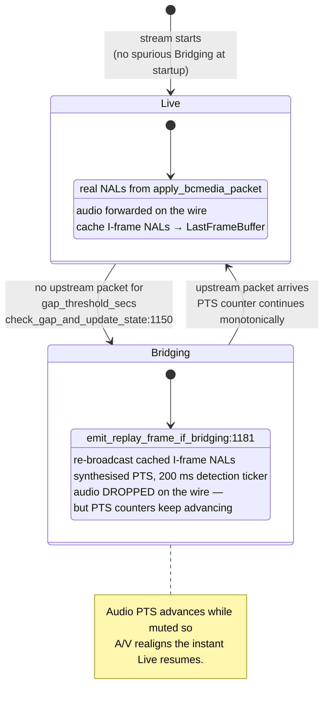

---

## 7. Wake lock lifecycle

`src/wake_lock.rs` — `AtomicUsize` plus **two separate** `Notify`s, both using
`notify_one()` so a permit is stored for a late waiter.

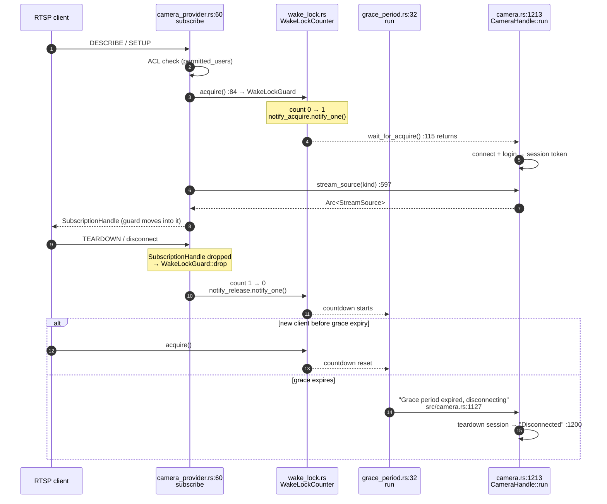

`WakeLockGuard` (`src/wake_lock.rs:26`) carries **no `#[must_use]`** —
`wake_lock.acquire();` as a bare statement acquires and instantly releases
(remediation P2-3).

---

## 8. MQTT control path

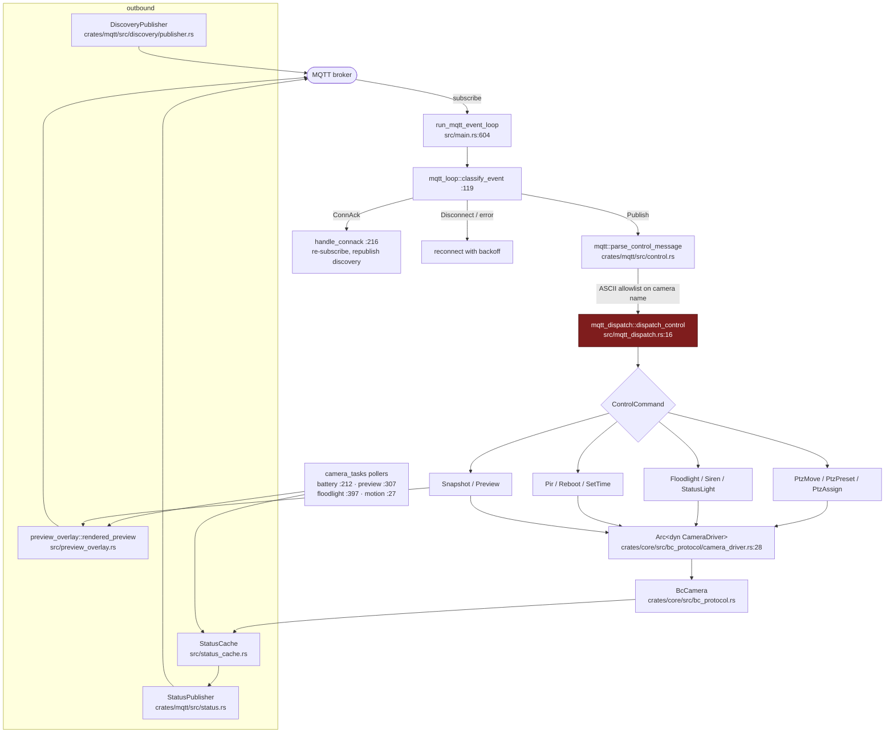

`preview_overlay` sits on the **MQTT** path only, not the RTSP one: it decodes
the preview JPEG and draws a `Connecting` / `Sleeping` caption before publish
(`Live` passes through untouched). Callers are `camera_tasks.rs:371` and
`mqtt_dispatch.rs:238`. The RTSP path's equivalent — showing something while the
camera sleeps — is gap bridging (§6), a different mechanism entirely.

`mqtt_dispatch.rs` is the one genuine layering inversion: at `:195` and `:343`
it manufactures `bairelay_neolink_core::bc_protocol::Error::Other(…)` for
failures that are purely binary-layer concerns ("PTZ preset name not in cache",
"Command timed out"). Remediation P3-2.

---

## 9. Camera connection path (core)

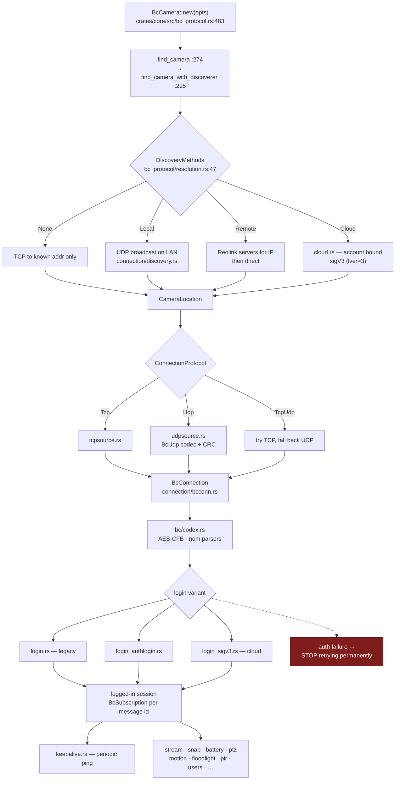

Connection failures retry with backoff and never crash the process. **Auth
failures stop retrying permanently** — the daemon must not hammer a camera with
bad credentials.

---

## 10. Wake server and push listener

The local replacement for Reolink's P2P cloud, so a battery camera can be woken
without any traffic leaving the LAN.

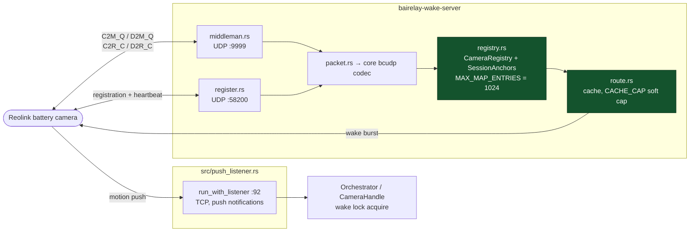

Every in-memory map here is capped with refresh-vs-insert distinguished, so a
hostile flood cannot amplify memory — verified clean in the remediation review.

---

## 11. One-shot command path

Separate from the daemon entirely: connect, do one thing, log out, exit with a
coarse code.

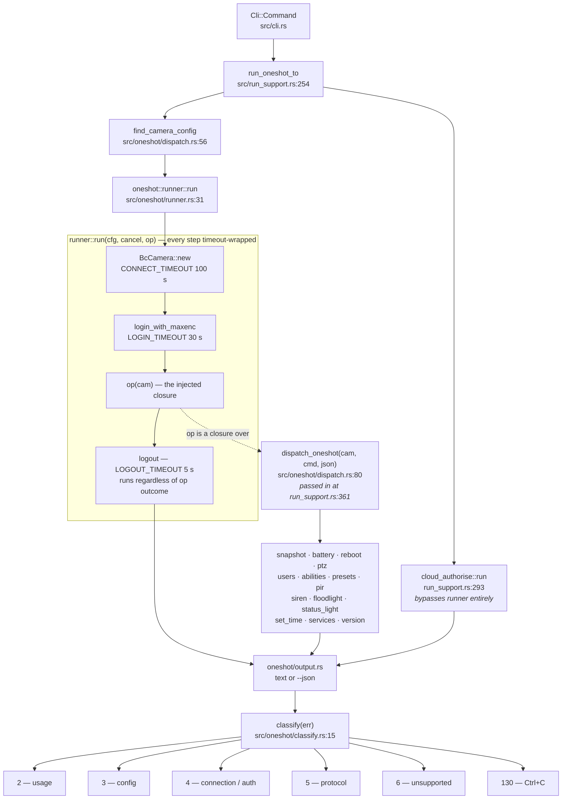

Splitting `dispatch_oneshot` out of `runner::run` is what lets the whole command
table be tested against `FakeCameraBuilder` without a TCP socket
(`src/oneshot/dispatch.rs:4`).

The nesting is also why this path shows up in remediation P2-5: the composed
future at `src/oneshot/runner.rs:50` measures ~34 KB. It is not the largest in
the workspace — that is `src/main.rs:101` at ~36 KB, with four more around
36 KB in `src/run_support.rs`.

---

## 12. Test seams

Everything is tested through traits rather than live hardware. Core's fakes sit
behind the `test-util` Cargo feature so a release build cannot substitute a fake
for a real camera.

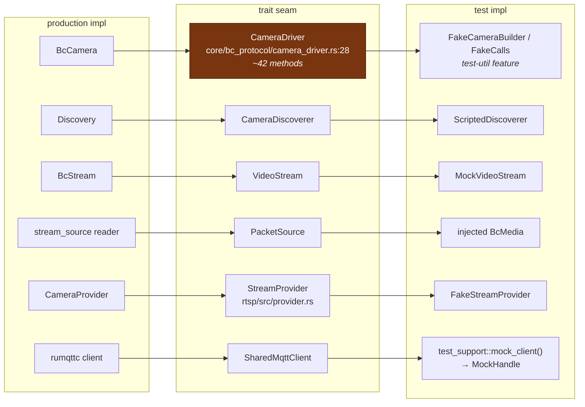

`CameraDriver` is the one seam under active question: it mirrors `BcCamera` so
the forwarding blanket impl reads one line per method, but no consumer needs all
~42 and every fake pays for all of them. Remediation P3-3 asks for an explicit
decision either way.

**Hang-protection discipline**: every mock-based "camera doesn't answer" test
wraps the op in `tokio::time::timeout(Duration::from_millis(200), …)`. A test
awaiting a channel with no guaranteed sender hangs `cargo test` forever.

---

## 13. Shared-state map

Which objects cross task boundaries, and what guards them. This is the map that
makes remediation P0-3 (poison-panic cascade) legible.

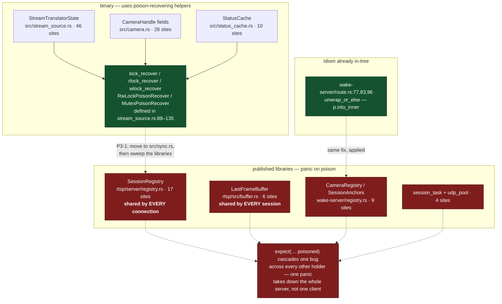

The idiom already exists in-tree (`crates/wake-server/src/route.rs:77,83,96`) —
it is simply not applied uniformly. Note these sites use `.expect("… poisoned")`
rather than `.unwrap()`, so grepping for `unwrap` finds none of them.

---

## 14. Live-verify log-marker contract

`tests/scripts/manual-verify.sh` is the live-hardware gate and drives the daemon
purely by grepping stdout. Reword a marker and the script does not fail loudly —
it stalls its poll window and reports a *misleading* FAIL.

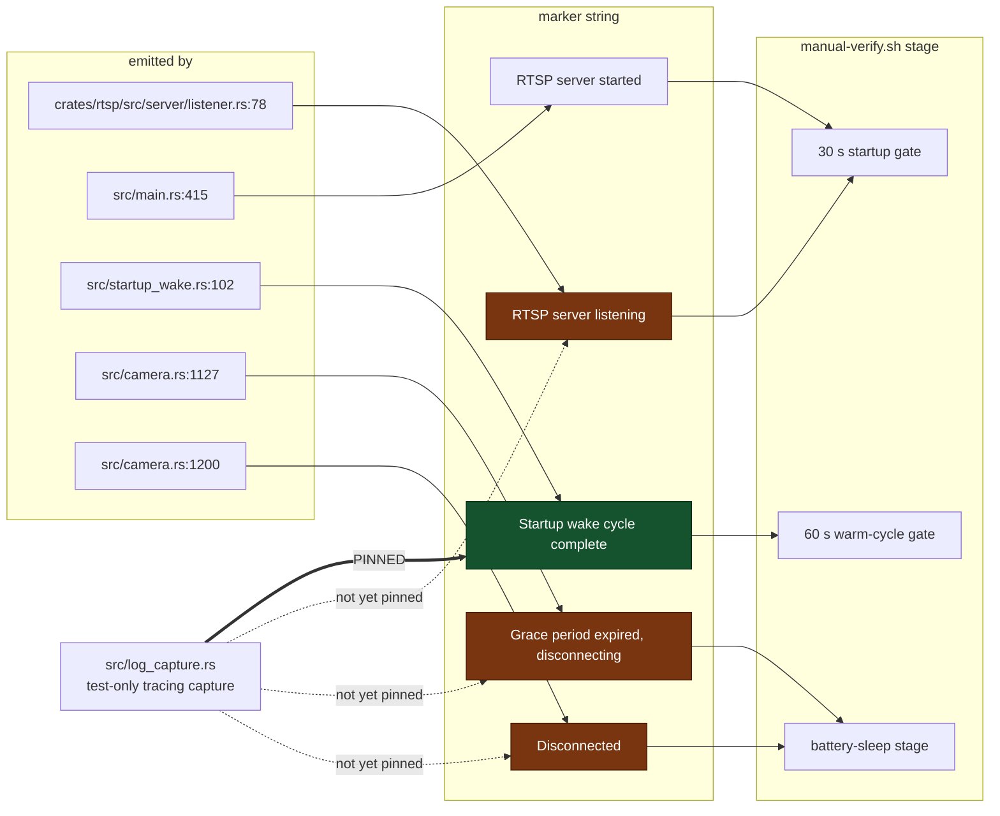

---

## Cross-reference to the remediation plan

| Diagram | Remediation item |
|---|---|
| §4 RTSP request path, step 8 | P0-2 — Basic auth offered over plaintext |
| §13 Shared-state map | P0-3 — poison-panic cascade · P3-1 — move helpers to `src/sync.rs` |
| §1 Crate dependency graph | P1-1 — no supply-chain scanning · P2-4 — duplicate dep trees |
| §14 Log-marker contract | P1-4 — marker contract unpinned |
| §8 MQTT control path | P3-2 — error-type layering inversion |
| §11 One-shot path | P2-5 — large futures |
| §12 Test seams | P3-3 — `CameraDriver` is a ~42-method trait |
| §5 Media data path, §6 gap bridging | P3-6 — `stream_source.rs` at 5441 lines |
| §7 Wake lock lifecycle | P2-3 — `#[must_use]` missing on `WakeLockGuard` |
| §2 Startup sequence | P1-5 — `permitted_users` unvalidated by `check-config` |

Nothing in these diagrams depends on P0-1 as the remediation plan states it: the
discovery flood test passes and `cargo test` is green. The gate is red on
`cargo clippy --all-targets -- -D warnings` instead —
`src/log_capture.rs:112`, `await_marker` is never used.
